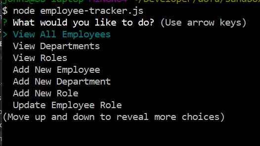
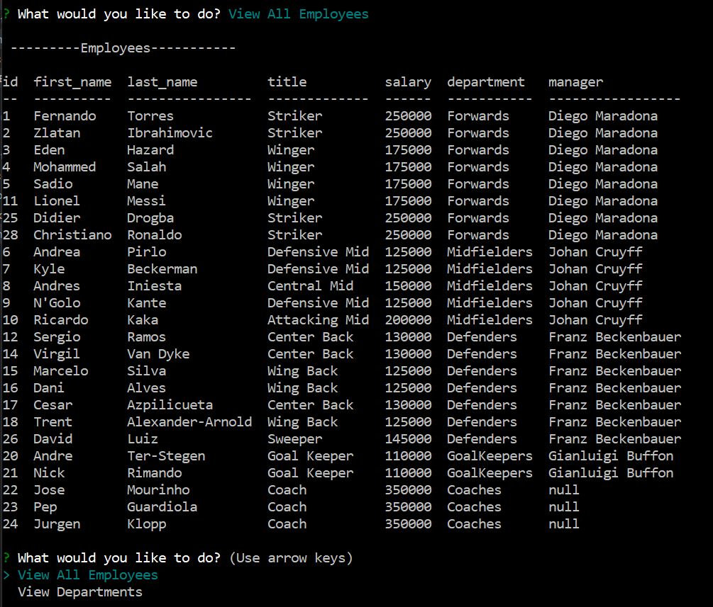
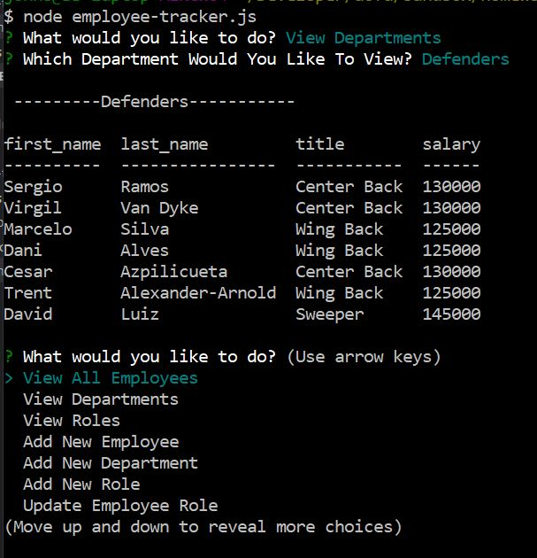
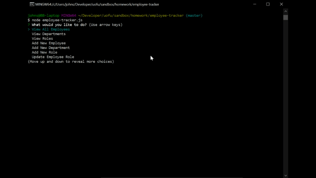

# Employee Tracker

Repository: https://github.com/aarkitekkt/employee-tracker

## Overview
​
The purpose of this application is to view and edit employee information such as department, salary, title, etc. 
​
### Gallery
​
Main Menu:

View All Employees:

​
View Department:

Add Employee:

​
### Problem

The biggest challenge faced with this application was creating the function to update the employee role.  The challenge came from having to generate an array role options to pass into the inquirer prompt as choices and then take that answer and pair it with the id from the database to generate the MYSQL query to make the requested change.

### Solution
​
My solution was to first query the database to get the full list of employees with their id, name, and title and push that data to an array which could be used in the inquirer prompt as choices for which employee was to be updated.  Once the choice was made, I used a split method to grab the id from the answer which could be passed into the final query.  Then the same process was used to list the new role choices and save the new role id.  Once both of these ids were saved, the final query could be generated to take the old role id and update it to the new role id. 

## Tech and Features Used
​
* MYSQL
* Javascript
* Express npm
* Inquirer npm
* Node JS
​
## How to use
​
First run "node employee-tracker.js" in the command line to begin using the application.  Once it is running, select from the list of options and follow the prompts to view, add, update, or remove employees. 
​
## Technical Overview
​
1. 
